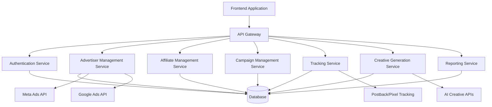

# TAS Affiliate Management System - Architecture Design

## Overview
The TAS Affiliate Management System is a comprehensive performance marketing platform that connects advertisers with affiliates, enabling efficient campaign management, tracking, and optimization. The system will provide features for advertiser management, affiliate management, campaign tracking, and AI-powered creative generation.

## Technology Stack

### Frontend
- **Framework**: React 18 with TypeScript
- **UI Library**: TailwindCSS with shadcn/ui components
- **State Management**: Redux Toolkit or Zustand
- **Routing**: React Router v6
- **Build Tool**: Vite
- **Testing**: Jest and React Testing Library

### Backend
- **Runtime**: Node.js 18+
- **Framework**: Express.js or Fastify
- **API**: RESTful API with potential GraphQL endpoints
- **Authentication**: JWT with refresh tokens
- **Documentation**: Swagger/OpenAPI

### Database
- **Primary**: PostgreSQL
- **Secondary**: Redis for caching and session management
- **ORM**: Prisma or TypeORM

### Infrastructure
- **Cloud Provider**: AWS or Google Cloud Platform
- **Containerization**: Docker
- **Orchestration**: Kubernetes or AWS ECS
- **CI/CD**: GitHub Actions
- **Monitoring**: Prometheus + Grafana
- **Logging**: ELK Stack (Elasticsearch, Logstash, Kibana)

### Third-Party Integrations
- **Meta Ads API** for Facebook/Instagram campaign management
- **Google Ads API** for Google campaign management
- **Payment Processing**: Stripe or PayPal
- **Email Service**: SendGrid or AWS SES
- **AI Creative Generation**: OpenAI, Stability AI, or similar APIs

## System Architecture

### High-Level Components

### Core Services

#### 1. Authentication Service
- User registration and login
- Role-based access control (Admin, Advertiser, Affiliate)
- JWT token management
- Password reset functionality

#### 2. Advertiser Management Service
- Advertiser profile management
- Campaign creation and management
- Budget allocation and control
- Integration with Meta and Google Ads APIs
- Performance analytics and reporting

#### 3. Affiliate Management Service
- Affiliate registration and profile management
- Offer selection and approval
- Commission tracking and management
- Postback configuration
- Performance dashboard

#### 4. Campaign Management Service
- Campaign creation and lifecycle management
- Creative asset management
- Targeting and bidding strategies
- Budget and scheduling controls
- A/B testing capabilities

#### 5. Tracking Service
- Postback URL generation and processing
- Pixel tracking implementation
- Event tracking and conversion measurement
- Real-time analytics dashboard
- Data validation and fraud detection

#### 6. Creative Generation Service
- AI-powered image generation
- AI-powered video generation
- Template-based creative creation
- Creative optimization and A/B testing
- Asset library management

#### 7. Reporting Service
- Performance analytics dashboards
- Custom report generation
- Data export capabilities
- Real-time and historical data views

## Database Schema Design

### Core Entities

#### Users
- id (UUID)
- email (string, unique)
- password_hash (string)
- role (enum: admin, advertiser, affiliate)
- first_name (string)
- last_name (string)
- created_at (timestamp)
- updated_at (timestamp)
- is_active (boolean)

#### Advertisers
- id (UUID)
- user_id (foreign key to Users)
- company_name (string)
- website_url (string)
- contact_email (string)
- contact_phone (string)
- billing_address (text)
- created_at (timestamp)
- updated_at (timestamp)

#### Affiliates
- id (UUID)
- user_id (foreign key to Users)
- company_name (string)
- website_url (string)
- contact_email (string)
- contact_phone (string)
- payment_details (json)
- created_at (timestamp)
- updated_at (timestamp)

#### Offers
- id (UUID)
- advertiser_id (foreign key to Advertisers)
- name (string)
- description (text)
- payout_type (enum: cpc, cpa, cpl, cps)
- payout_amount (decimal)
- status (enum: draft, active, paused, archived)
- tracking_url (string)
- preview_url (string)
- created_at (timestamp)
- updated_at (timestamp)

#### Campaigns
- id (UUID)
- advertiser_id (foreign key to Advertisers)
- name (string)
- description (text)
- status (enum: draft, active, paused, completed)
- start_date (date)
- end_date (date)
- budget (decimal)
- daily_budget (decimal)
- created_at (timestamp)
- updated_at (timestamp)

#### Creatives
- id (UUID)
- campaign_id (foreign key to Campaigns)
- name (string)
- type (enum: image, video, html)
- url (string)
- size (string)
- created_at (timestamp)
- updated_at (timestamp)

#### Conversions
- id (UUID)
- affiliate_id (foreign key to Affiliates)
- offer_id (foreign key to Offers)
- campaign_id (foreign key to Campaigns)
- conversion_type (string)
- payout_amount (decimal)
- ip_address (string)
- user_agent (string)
- created_at (timestamp)

#### Postback Configurations
- id (UUID)
- affiliate_id (foreign key to Affiliates)
- offer_id (foreign key to Offers)
- postback_url (string)
- method (enum: GET, POST)
- headers (json)
- parameters (json)
- is_active (boolean)
- created_at (timestamp)
- updated_at (timestamp)

## Tracking Mechanisms

### Postback Tracking
- Server-to-server tracking
- Customizable postback URLs
- Dynamic parameter substitution
- Retry mechanisms for failed postbacks

### Pixel Tracking
- Image pixel tracking
- JavaScript pixel tracking
- Conversion event tracking
- Fraud detection and prevention

### API Tracking
- RESTful API endpoints for conversion recording
- Real-time conversion processing
- Batch conversion processing capabilities

## AI Creative Generation Features

### Image Generation
- Text-to-image generation using DALL-E or Stable Diffusion
- Brand-consistent creative generation
- Multiple style and template options
- Automated resizing for different ad placements

### Video Generation
- Text-to-video generation
- Automated video editing and composition
- Branding and watermark integration
- Format optimization for different platforms

### Creative Optimization
- A/B testing for creative assets
- Performance-based creative recommendations
- Automated creative rotation
- Creative performance analytics

## Security Considerations

- End-to-end encryption for sensitive data
- Secure API key management
- Rate limiting and DDoS protection
- Regular security audits and penetration testing
- GDPR and privacy compliance
- Secure payment processing

## Scalability Considerations

- Microservices architecture for independent scaling
- Load balancing and auto-scaling
- Database read replicas for high-traffic scenarios
- Caching strategies for improved performance
- CDN integration for asset delivery
- Message queues for asynchronous processing

## Deployment Strategy

- Containerized deployment using Docker
- Infrastructure as Code (IaC) with Terraform
- Blue-green deployment strategy
- Automated rollback capabilities
- Health checks and monitoring
- Backup and disaster recovery procedures